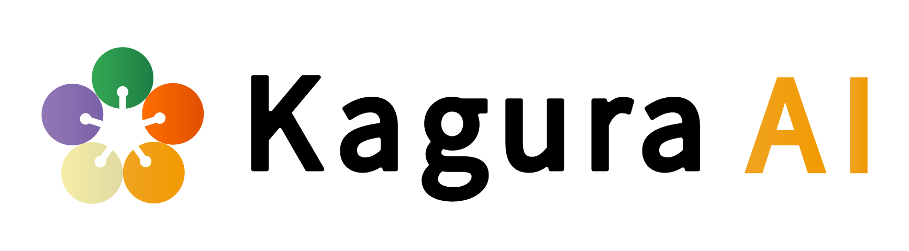

<p align="center">
  
</p>

# kagura-agent

[](https://github.com/kagura-ai/kagura-agent/actions/workflows/ci.yml)

[](LICENSE)


**A memory-backed autonomous AI agent.** It combines a pluggable agentic brain,
[Kagura Memory Cloud](https://github.com/kagura-ai/memory-cloud), a Docker security
membrane, and a Slack/Discord cockpit. Use it from the CLI with `run`, `repl`,
`serve`, `doctor`, and `setup`.

The default brain is Claude through the
[Claude Agent SDK for Python](https://docs.claude.com/en/api/agent-sdk). The optional
[`kagura-brain`](https://github.com/kagura-ai/kagura-brain) backend adds Claude,
Codex, and Ollama-compatible providers behind the same interface.

> **Status:** alpha, package version `0.7.0`. The v0.1–v0.7 pure-Python skeleton is
> implemented and tested with strict typing and at least 95% coverage. Live Docker,
> cloud credential, and chat-transport edges remain deployment-specific.

## Why kagura-agent

- **Persistent memory:** decisions, failures, and progress survive individual runs.
- **Real hands:** filesystem, shell, Git, Docker, cloud APIs, and custom MCP tools.
- **Bounded autonomy:** credentials, mounts, and egress are granted per task.
- **Operator control:** long-running work can be launched, resumed, approved, or
  stopped from a CLI or chat cockpit.

## Quickstart

You need Python 3.11 or newer, a Kagura Memory Cloud login, and a configured brain.
The base package intentionally ships without a brain dependency.

```bash
python -m venv .venv
# Activate the virtual environment, then install the default brain:
pip install 'kagura-agent[claude]'

# Authenticate both required services:
kagura auth login
claude

# Verify the environment and run a task:
kagura-agent doctor
kagura-agent run "summarize the repository layout"
```

`ANTHROPIC_API_KEY` can replace the Claude subscription login. For the
`kagura-brain` Claude/Codex/Ollama backend, chat transports, Docker mode, Windows
activation, and first-run troubleshooting, see [Getting started](docs/getting-started.md).

## Main commands

| Command | Purpose |
|---|---|
| `kagura-agent run "…"` | Run one task |
| `kagura-agent repl` | Continue an interactive session |
| `kagura-agent serve --transport slack` | Start the chat cockpit |
| `kagura-agent doctor` | Check memory, brain, Docker, and provider readiness |
| `kagura-agent setup transport` | Show transport setup guidance |

## Architecture at a glance

The session layer orchestrates tasks and checkpoints without depending on a
specific model SDK. The selected brain owns its agentic tool loop; Kagura Memory
Cloud provides durable context; the host-side membrane controls filesystem,
network, and credential access.


The full rationale, provider boundary, capability model, security membrane, and
cockpit protocol live in the [design document](docs/design.md).

## Documentation

| Document | Contents |
|---|---|
| [Documentation index](docs/README.md) | Map of all project documentation |
| [Getting started](docs/getting-started.md) | Installation, authentication, commands, bootstrap, troubleshooting |
| [Design](docs/design.md) | Scope, architecture, capabilities, security membrane, cockpit internals |
| [Project status and scope](docs/project-status.md) | Current boundary, roadmap, repository map, milestone coverage |
| [Extending](docs/extending.md) | Custom MCP tools, egress, credential leasing, secret handling |
| [Operations](docs/operations.md) | Incident response and credential rotation runbooks |
| [Bootstrap evaluation](docs/bootstrap-eval.md) | Ranking evaluation and rollout gate |
| [Legal notes](docs/legal.md) | Open terms-of-service and operator-responsibility questions |
| [Contributing](CONTRIBUTING.md) | Development workflow and contribution guide |
| [Security policy](SECURITY.md) | Supported versions and vulnerability reporting |
| [Changelog](CHANGELOG.md) | Release history |

## Development

```bash
git clone https://github.com/kagura-ai/kagura-agent.git
cd kagura-agent
pip install -e '.[dev]'
pytest
mypy
```

See [CONTRIBUTING.md](CONTRIBUTING.md) for the full development workflow.

## Related repositories

| Repository | Role |
|---|---|
| [`kagura-ai/kagura-engineer`](https://github.com/kagura-ai/kagura-engineer) | Independent coding-specialized sibling agent |
| [`kagura-ai/kagura-code-reviewer`](https://github.com/kagura-ai/kagura-code-reviewer) | Review subagent used by kagura-engineer |
| [`kagura-ai/memory-cloud`](https://github.com/kagura-ai/memory-cloud) | Persistent memory backbone and MCP server |
| [`kagura-ai/kagura-memory-python-sdk`](https://github.com/kagura-ai/kagura-memory-python-sdk) | Trusted-host bootstrap SDK |

## License

[Apache License 2.0](LICENSE) — © 2026 Kagura AI. See [NOTICE](NOTICE) for
attribution.
